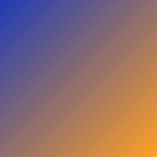
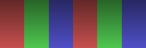

# tui-deck

A **Marp-compatible** terminal slide deck presenter

<!-- notes: Welcome everyone! This deck showcases every rendering feature tui-deck supports. -->

---

## Inline Formatting

You can use **bold**, _italic_, and ~~strikethrough~~ text.

Combine them: **_bold italic_**, **~~bold strikethrough~~**, _~~italic strikethrough~~_

Inline `code spans` render with distinct background colors.

Links render too: [tui-deck on GitHub](https://github.com/ldlac/tui-deck)

<!-- notes: All standard Markdown inline formatting is supported with proper terminal styling. -->

---

## Bullet Lists

- First item with **bold** emphasis
- Second item with `inline code`
- Third item with _italic_ text
- Nested concepts: **Rust** + `ratatui` + _terminal UI_
- Unicode works: arrows →, bullets •, stars ★

---

## Numbered Lists

1. Parse Markdown with `pulldown-cmark`
2. Extract **Marp directives** from front matter
3. Build a `Slide` AST with rich inline content
4. Render via `ratatui` with `syntect` highlighting
5. Display in the terminal with ~~no browser needed~~

---

## Code Highlighting

```rust
use std::collections::HashMap;

fn fibonacci(n: u64) -> u64 {
    match n {
        0 => 0,
        1 => 1,
        _ => fibonacci(n - 1) + fibonacci(n - 2),
    }
}

fn main() {
    let result = fibonacci(10);
    println!("fib(10) = {}", result);
}
```

---

## Multi-Language Support

```python
from dataclasses import dataclass

@dataclass
class Slide:
    title: str
    content: list[str]

    def render(self) -> str:
        return f"# {self.title}\n" + "\n".join(self.content)
```

```javascript
const present = (slides) => {
  slides.forEach((slide, i) => {
    console.log(`--- Slide ${i + 1} ---`);
    console.log(slide.title);
  });
};
```

---

## Tables with Unicode

| Feature           | Status | Notes                   |
| ----------------- | ------ | ----------------------- |
| **Bold** cells    | Done   | Full inline support     |
| `Code` cells      | Done   | Padded backgrounds      |
| Unicode ← → ★     | Done   | Width-aware alignment   |
| _Italic_ cells    | Done   | Proper modifier support |
| ~~Strikethrough~~ | Done   | Dim + crossed out       |

---

## Images

Inline images with size control:



A logo with height constraint:


---

## Wide Banner Image



Images are rendered using the **Kitty Graphics Protocol** with automatic fallback to half-block characters.

---

## Blockquotes

> The terminal is the original user interface.
> Everything old is new again.

Regular paragraph after a blockquote.

> Single-line quotes work too.

---

## ASCII Art

```ascii
    ╔═══════════════════════════════════╗
    ║           ARCHITECTURE            ║
    ║  ┌───────────┐   ┌─────────────┐  ║
    ║  │ parser.rs │   │ renderer.rs │  ║
    ║  │           │   │             │  ║
    ║  │ Markdown  │   │   ratatui   │  ║
    ║  │    AST    │   │    Spans    │  ║
    ║  └───────────┘   └─────────────┘  ║
    ║        │              │           ║
    ║        ▼              ▼           ║
    ║   pulldown-cmark   syntect        ║
    ╚═══════════════════════════════════╝
```

<!-- class: lead -->

---

## Lead Class

Vertically centered content for emphasis slides.

The `lead` class centers everything in the viewport.

<!-- class: -->

---


## Background Image

This slide uses a **background image** via the `` Marp syntax.

Text overlays on top of the background.

---

## Directives Demo

<!-- _header: "Custom Header" -->
<!-- _footer: "Custom Footer" -->

This slide has **per-slide** header and footer overrides.

- `_header:` overrides the global header
- `_footer:` overrides the global footer
- Underscore prefix = current slide only

---

## Front Matter Options

```yaml
---
marp: true
theme: default # Theme name
paginate: true # Show page numbers
class: invert # Global CSS class
backgroundColor: #1a1a2e  # Background color
header: "My Deck" # Global header
footer: "Footer text" # Global footer
headingDivider: 2 # Auto-split at h2
---
```

<!-- class: lead -->

---

## Presenter Mode

Run two terminals side by side:

```bash
# Terminal 1: Main presentation
tui-deck slides.md

# Terminal 2: Presenter console
tui-deck slides.md --presenter
```

The presenter window shows:

- Current slide (large)
- Next slide preview
- Presenter notes
- Elapsed timer

<!-- notes: The presenter console connects via Unix socket. Slide changes sync automatically between both windows. -->

---

## Navigation

| Key               | Action         |
| ----------------- | -------------- |
| `j` / `Space`     | Next slide     |
| `k` / `Backspace` | Previous slide |
| `h` / `←`         | Previous slide |
| `l` / `→`         | Next slide     |
| `q`               | Quit           |

???
Remind the audience they can use vim-style keys or arrow keys.
All navigation is instant with zero latency.
???

---

# Thank You!

Built with **Rust**, `ratatui`, and `syntect`

[github.com/ldlac/tui-deck](https://github.com/ldlac/tui-deck)
